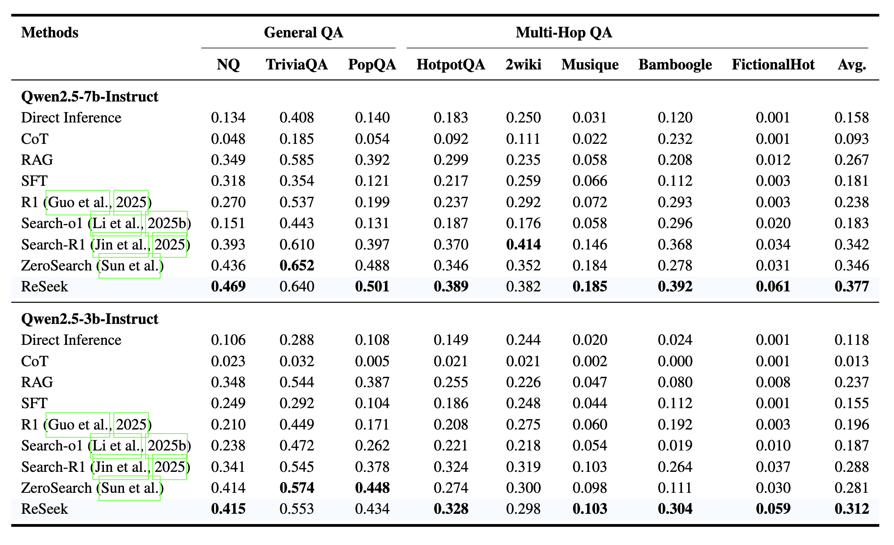
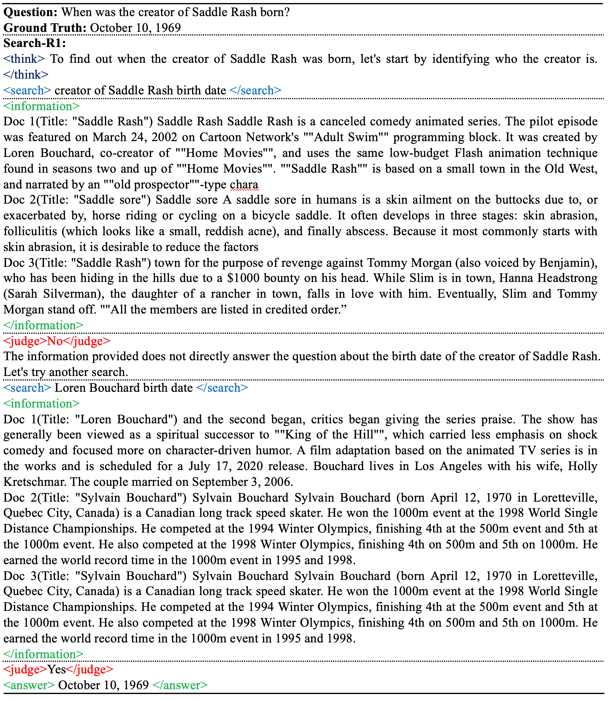

<div align="center">
<h1>ReSeek: A Self-Correcting Framework for Search Agents with Instructive Rewards
</h1>
</div>


<div align="center">
  <a href='https://tencentbac.github.io/ReSeek/'></a>
  <a href='https://arxiv.org/abs/2510.00568'></a>
  <a href='https://huggingface.co/spaces/TencentBAC/SearchAgent_Leaderboard'></a>
  <a href='https://huggingface.co/TencentBAC/ReSeek-qwen2.5-3b-em-grpo'></a>
  <a href='https://huggingface.co/datasets/TencentBAC/FictionalHot'></a>

</div>


<p align="center">
  <i><b>Shiyu Li, Yang Tang, Yifan Wang, Peiming Li, Xi Chen</b></i><br>
  <i>Basic Algorithm Center, PCG, Tencent</i><br>
  <i>Tsinghua Shenzhen International Graduate School, Tsinghua University</i>
</p>


# 🔥 News

- **[2025.10.14]** Released the initial codebase.
- **[2025.10.1]** Released the dataset, leaderboard, model and paper.


# 🤗 Resources

| Type | Links |
| ---- | ----- |
| **Models** | •[ReSeek-qwen2.5-3b-em-grpo](https://huggingface.co/TencentBAC/ReSeek-qwen2.5-3b-em-grpo) |
| **Datasets** | •[FictionalHot](https://huggingface.co/datasets/TencentBAC/FictionalHot) |
| **Leaderboard** | •[Search Agent Leaderboard](https://huggingface.co/spaces/TencentBAC/SearchAgent_Leaderboard) |


# 📌 Introduction

- We propose **ReSeek**, a novel reinforcement learning framework that enables search agents to dynamically identify and recover from erroneous search paths during an episode through a self-correction mechanism.
- Through a special **JUDGE** action, agents can evaluate retrieved information and re-plan their search strategy. We design a dense, instructive reward function that provides fine-grained feedback on both factual correctness and contextual utility.
- We advocate for the **Hot Benchmark** evaluation principle and introduce **FictionalHot** as a contamination-resistant benchmark. Extensive experiments show that ReSeek significantly outperforms SOTA baselines in task success rate and path faithfulness.
- ReSeek particularly excels in multi-hop reasoning scenarios, demonstrating robust self-correction capabilities in complex knowledge-intensive tasks.


# 🛠 Dependencies

### Basic Installation

```bash
# Clone the repository
git clone https://github.com/TencentBAC/ReSeek.git
cd ReSeek

conda create -n ReSeek python=3.10
conda activate ReSeek

bash scripts/install_vllm_sglang_mcore.sh

# verl
pip install --no-deps -e .
```

### Optional Dependencies

**NPU (Ascend) Support**:
```bash
# follow https://verl.readthedocs.io/en/latest/ascend_tutorial/ascend_quick_start.html to install vllm & vllm-ascend

pip install -r requirements-npu.txt
pip install -e .
```


# 📖 Quick Start

### (1) Environment Variables

Before running training scripts, set the following environment variables:

```bash
# Set project root directory
export PROJECT_ROOT=/path/to/ReSeek

# Set model directory
export MODEL_DIR=/path/to/models

# Set data directory
export DATA_DIR=/path/to/datasets
```

### (2) Data Preparation

Download the ReSeek training dataset:

```bash
# Preprocess dataset
python utils/preprocess_reseek_dataset.py \
  --hf_repo_id TencentBAC/ReSeek_train_test \
  --local_dir ${DATA_DIR}/processed_dateset
```

### (3) Download Pre-trained Models

```bash
# Download base model (e.g., Qwen2.5-3B-Instruct)
huggingface-cli download --resume-download Qwen/Qwen2.5-3B-Instruct --local-dir Qwen2.5-3B-Instruct

# (Optional) Download ReSeek fine-tuned model
huggingface-cli download --resume-download TencentBAC/ReSeek-qwen2.5-3b-em-grpo --local-dir ReSeek-qwen2.5-3b-em-grpo
```

### (4) Build Retrieval Index (optional)

**Using Transformers**:
```bash
cd search/retrieval
bash build_index.sh
```

**Using vLLM**:
```bash
cd search/retrieval
bash build_index_vllm.sh
```

### (5) Launch Retrieval Service

```bash
cd search
bash retrieval_launch.sh
```

### (6) Conduct RL Training
(optional) set the parameter `trainer.device=npu` on npu. 

**GRPO Training**:
```bash
cd scripts

# 3B model
bash train_grpo.sh

# 7B model
bash train_grpo_7b.sh
```


**PPO Training**:
```bash
cd scripts

# 3B model
bash train_ppo.sh

# 7B model
bash train_ppo_7b.sh
```


# 💡 Performance

### 📊 Main Results

<div align="center">
    
</div>

ReSeek achieves state-of-the-art performance across eight open-domain QA benchmarks:

- **Qwen2.5-7B**: Average accuracy of **0.377**, surpassing ZeroSearch's 0.346
- **Multi-hop Reasoning**: Excels on complex multi-hop benchmarks like HotpotQA and Bamboogle
- **FictionalHot**: Scores **0.061** on contamination-resistant stress test, while Direct Inference achieves only ~0.001

### 📊 Hot Benchmark

We propose the **Hot Benchmark** evaluation principle to address inconsistencies in experimental settings:

- **Test Sets**: All 7 datasets (NQ, TriviaQA, PopQA, HotpotQA, 2Wiki, Musique, Bamboogle)
- **Training Set**: Unified training set merging NQ and HotpotQA training splits
- **Corpus**: 2018 Wikipedia corpus (wiki-18) for reproducible evaluation
- **Metrics**: Exact Match (EM) as the primary metric for fair comparison
- **Retrieval**: Top-k=3 with maximum T=4 tool-use turns per question
- **Embeddings**: E5 embeddings for search backend
- **Models**: Qwen2.5-3B/7B-Instruct as backbone models

### 📊 Self-Correction Case Study

<div align="center">
    
</div>

ReSeek demonstrates robust self-correction through the JUDGE action:

1. After initial search, the JUDGE action correctly identifies insufficient information
2. Triggers a second targeted search
3. Successfully retrieves the correct answer

This dynamic correction mechanism enables ReSeek to excel in complex multi-hop reasoning scenarios.


# 🙏 Acknowledgements

This work is implemented based on [Search-R1](https://github.com/PeterGriffinJin/Search-R1), [veRL](https://github.com/volcengine/verl). We sincerely thank the authors of these projects for their valuable contributions to the open-source community.


# 📧 Contact

If you have any questions, feel free to reach out:
- **GitHub Issues**: [https://github.com/TencentBAC/ReSeek/issues](https://github.com/TencentBAC/ReSeek/issues)


# 🚩 Citation

If this work is helpful, please kindly cite as:

```bibtex
@article{li2025reseek,
  title={ReSeek: A Self-Correcting Framework for Search Agents with Instructive Rewards},
  author={Li, Shiyu and Tang, Yang and Wang, Yifan and Li, Peiming and Chen, Xi},
  journal={arXiv preprint arXiv:2510.00568},
  year={2025}
}
```


# 📄 License

This project is licensed under the Apache License 2.0. See the [LICENSE](LICENSE) file for details.
